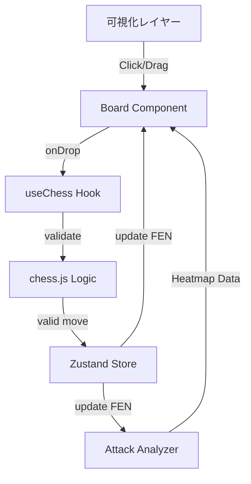

# データフロー & 状態管理

## 1. 状態管理 (State Management)
本プロジェクトでは **Zustand** を採用し、アプリケーション全体の状態を管理する。

### Game Store (`useGameStore`)
| State Key | Type | Description |
| :--- | :--- | :--- |
| `fen` | `string` | 現在の盤面を表すFEN文字列 (例: `rnbqkbnr/...`) |
| `turn` | `'w' \| 'b'` | 現在の手番 |
| `history` | `string[]` | 棋譜の履歴 (SAN形式) |
| `captured` | `Piece[]` | 取られた駒のリスト |
| `status` | `'active' \| 'checkmate' \| 'draw'` | ゲームの進行状況 |
| `vizMode` | `'none' \| 'board' \| 'piece'` | 現在選択中の可視化モード |
| `focusedSquare` | `Square \| null` | Piece Scopeモードで選択中のマス |

## 2. データフロー (Data Flow)

### ユーザーアクションの流れ
1. **User Action**: ユーザーが盤面上の駒をドラッグ or クリック。
2. **Validation**: `react-chessboard` のイベントハンドラから `chess.js` の検証関数を呼び出し、手が合法かチェック。
3. **State Update**:
   - 合法なら `chess.js` インスタンスの状態を更新。
   - 新しい `FEN` を取得し、Zustand Store の `fen` を更新。
   - ターン情報、棋譜などを更新。
4. **Re-render**: Store の変更を検知し、React コンポーネントが再レンダリング。
5. **Analysis (Visualization)**:
   - `fen` の変更をトリガーに、`analyzeBoard(fen)` 関数が実行される。
   - 攻撃範囲データ（ヒートマップ配列など）が再計算される。
   - `Board` コンポーネントの上にオーバーレイとして可視化レイヤーが描画される。

### chess.js と React の同期
`chess.js` は純粋なJSクラスであり、Reactの状態管理外にある。そのため、Reactコンポーネント内では `ref` として保持するか、毎回新しいインスタンスを生成して利用する。
- **方針**: パフォーマンスを考慮し、シングルトンに近い形で扱うか、カスタムフック `useChess` 内で `useState` (FEN) と連動させる。

